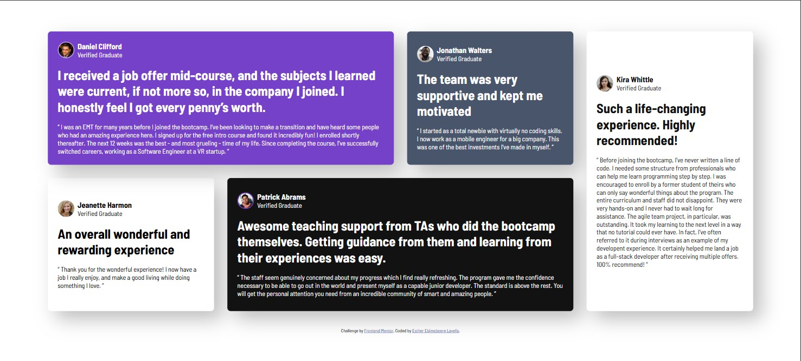
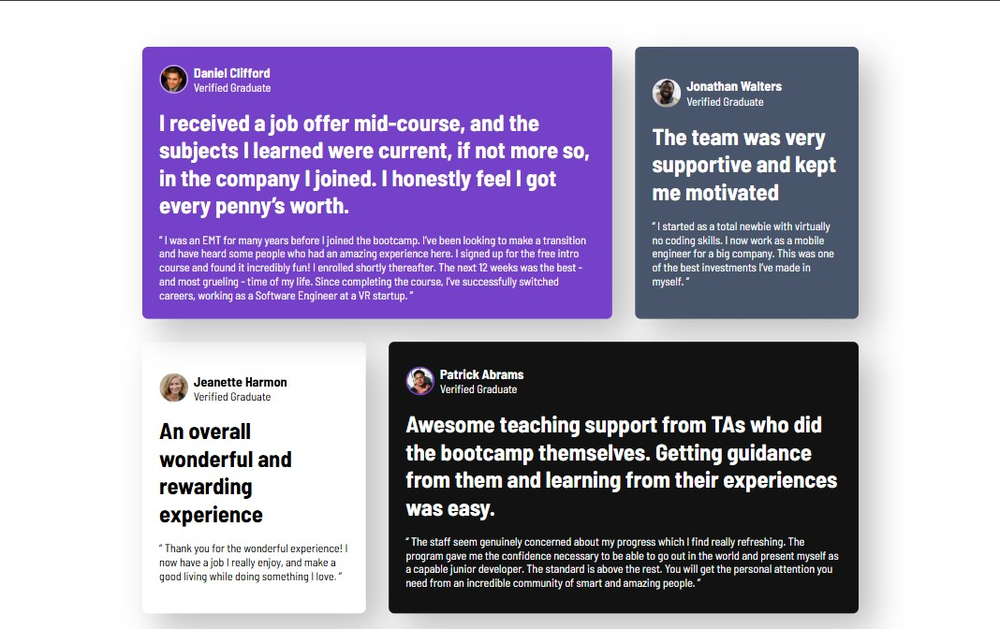
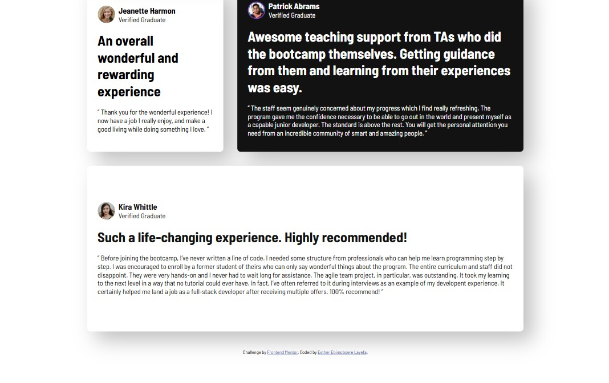
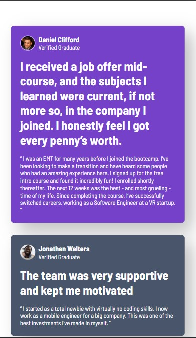
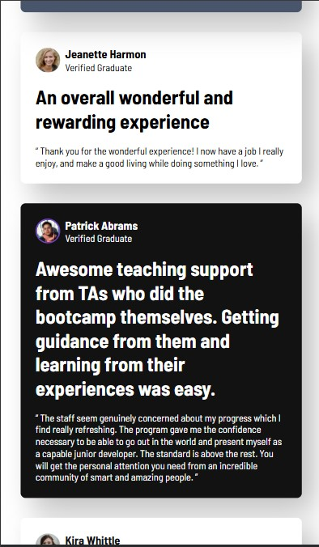
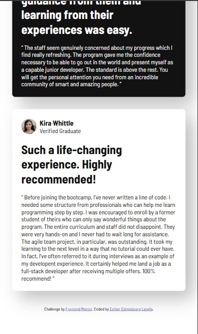

# Frontend Mentor - Testimonials grid section solution

This is a solution to the [Testimonials grid section challenge on Frontend Mentor](https://www.frontendmentor.io/challenges/testimonials-grid-section-Nnw6J7Un7). Frontend Mentor challenges help you improve your coding skills by building realistic projects.

## Table of contents

- [Overview](#overview)
  - [The challenge](#the-challenge)
  - [Screenshot](#screenshot)
  - [Links](#links)
- [My process](#my-process)
  - [Built with](#built-with)
  - [What I learned](#what-i-learned)
  - [Continued development](#continued-development)
  - [AI Collaboration](#ai-collaboration)
- [Author](#author)
- [Acknowledgments](#acknowledgments)

## Overview

### The challenge

Users are able to:

- View the optimal layout for the site depending on their device's screen size

### Screenshot








### Links

- Solution URL: [Add solution URL here](https://your-solution-url.com)
- Live Site URL: [Add live site URL here](https://your-live-site-url.com)

## My process

### Built with

- Semantic HTML5 markup
- CSS custom properties
- Flexbox
- CSS Grid
- Mobile-first workflow

### What I learned

This project was so sweet! I enjoyed every part of the process of making it.
I also went ahead to understand the box-shadow property well enough and I understand it excellently now!
I find so much joy and fufillment creating things like this...from bottom up.
God bless creativity!

```css
section {
  border-radius: 8px;
  padding: 1.5rem;
  display: flex;
  flex-direction: column;
  gap: 1.2rem;
  justify-content: center;
  box-shadow: 20px 20px 45px rgba(0, 0, 0, 0.25); /* this creates a soft, crispy look of the shadow born light coming from the left corner */
}
```

### Continued development

Indeed, project based learning is king. I want to keeep creating and building projects so I master frontend development. I can't wait to begin JavaScript!

### AI Collaboration

I used DeepSeek AI to understand and demystify the "box-shadow" property. It was an immense joyous ride!

## Author

- Website - [Add your name here](https://www.your-site.com)
- Frontend Mentor - [@The-Queen-Builds](https://www.frontendmentor.io/profile/The-Queen-Builds)
- Twitter - [@EbimoboereLaye](https://www.twitter.com/EbimoboereLaye)

## Acknowledgments

Bless God almighty, the giver of life! He is the one behind everything. I love Him so much. I do this for Him. Thank you Jesus!
